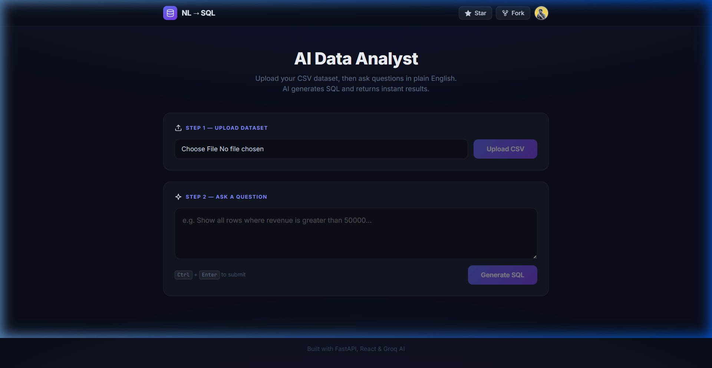
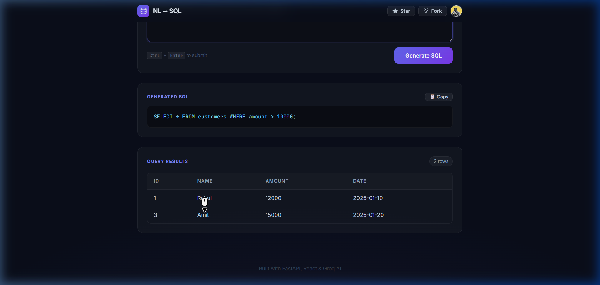

<div align="center">

# AI Data Analyst

Upload any CSV, ask questions in plain English, and get SQL plus results instantly.

[](https://nl-sql-teal.vercel.app/)
[](https://github.com/omsudhamsh/nl-sql/stargazers)
[](https://github.com/omsudhamsh/nl-sql/fork)
[](LICENSE)

<br/>



</div>

---

## Features

- CSV upload for ad hoc datasets
- Natural language to SQL using Groq LLaMA 3.1
- Query results displayed in a responsive table
- Dynamic schema detection from uploaded CSV
- One-click SQL copy
- Keyboard shortcut for submission
- Read-only SQL execution (SELECT only)

---

## Screenshots

<div align="center">

| Upload Dataset | Query Results |
|:-:|:-:|
|  |  |

</div>

---

## Architecture

```
┌─────────────────────────────────────────────────────────┐
│                    FRONTEND (Vercel)                     │
│                                                         │
│   React + Vite + Tailwind CSS                           │
│   ┌───────────────────────────────────────────┐         │
│   │  Step 1: Upload CSV file                  │         │
│   │  Step 2: Ask question in plain English    │         │
│   └──────────┬────────────────┬───────────────┘         │
│              │ POST /upload   │ POST /query             │
└──────────────┼────────────────┼─────────────────────────┘
               │                │
               ▼                ▼
┌─────────────────────────────────────────────────────────┐
│                   BACKEND (Render)                       │
│                                                         │
│   Spring Boot + Java                                    │
│   ┌─────────────────┐    ┌──────────────────────┐       │
│   │  /upload API    │    │  /query API          │       │
│   │  CSV → SQLite   │    │  Question → Groq LLM │       │
│   │  via JDBC       │    │  → SQL → Execute     │       │
│   └────────┬────────┘    └──────────┬───────────┘       │
│            │                        │                   │
│            ▼                        ▼                   │
│   ┌─────────────────────────────────────────┐           │
│   │   SQLite Database (uploaded_data.db)    │           │
│   │   Dynamic table from uploaded CSV       │           │
│   └─────────────────────────────────────────┘           │
└─────────────────────────────────────────────────────────┘
```

### How It Works

1. **Upload** a CSV file — backend saves it to SQLite using JDBC
2. **Schema auto-detection** — column names and types are inferred from CSV
3. **Ask a question** in natural language (e.g., *"Show employees with salary > 50000"*)
4. **Groq AI (LLaMA 3.1-8B)** generates a `SELECT` SQL query using the detected schema
5. **Backend executes the SQL** on the SQLite database
6. **Results** are returned as JSON and displayed in a styled table

---

## Tech Stack

| Layer | Technology | Purpose |
|-------|-----------|---------|
| **Frontend** | React 19, Vite 7, Tailwind CSS 4 | UI & styling |
| **Backend** | Spring Boot, Java | REST API |
| **AI/LLM** | Groq Cloud, LLaMA 3.1-8B | NL → SQL conversion |
| **Database** | SQLite, JDBC, Commons CSV | Dynamic data storage |
| **Deployment** | Vercel (frontend), Render (backend) | Hosting |

---

## Getting Started

### Prerequisites

- **Node.js** ≥ 18
- **Java** 17+
- **Maven**
- **Groq API Key** — Get one free at [console.groq.com](https://console.groq.com)

### 1. Clone the Repository

```bash
git clone https://github.com/omsudhamsh/nl-sql.git
cd nl-sql
```

### 2. Run the Backend

```bash
cd backend

# Export API key (set this in your shell)
export GROQ_API_KEY=your_groq_api_key_here

# Run the backend
mvn spring-boot:run
```

The API server will start at `http://127.0.0.1:8000`

### 3. Run the Frontend

```bash
cd frontend/nl-sql

# Install dependencies
npm install

# Run dev server
npm run dev
```

The app will be available at `http://localhost:5173`

### 4. Use the App

1. Upload a CSV file.
2. Ask a question in natural language or paste a valid `SELECT` query.
3. Copy the generated SQL or review the result table.

---

## Project Structure

```
nl-sql/
├── backend/
│   ├── src/main/java/
│   │   └── com/nlsql/        # Spring Boot app, routes, services
│   ├── src/main/resources/
│   │   └── application.properties
│   └── pom.xml
│
├── frontend/nl-sql/
│   ├── src/
│   │   ├── App.jsx          # Main app (upload + query UI)
│   │   ├── index.css         # Premium dark theme styles
│   │   └── main.jsx         # React entry point
│   ├── index.html
│   ├── vite.config.js
│   └── package.json
│
├── assets/                  # Screenshots for README
└── README.md
```

---

## Safety

- Only `SELECT` queries are allowed — the backend rejects `INSERT`, `UPDATE`, `DELETE`, etc.
- SQL output is sanitized to strip markdown formatting from LLM responses
- CORS configured for secure cross-origin requests
- API key should be stored in environment variables and never committed

---

## License

This project is licensed under the MIT License — see the [LICENSE](LICENSE) file for details.

---

<div align="center">

Built by [Om Sudhamsh Padma](https://github.com/omsudhamsh)

</div>